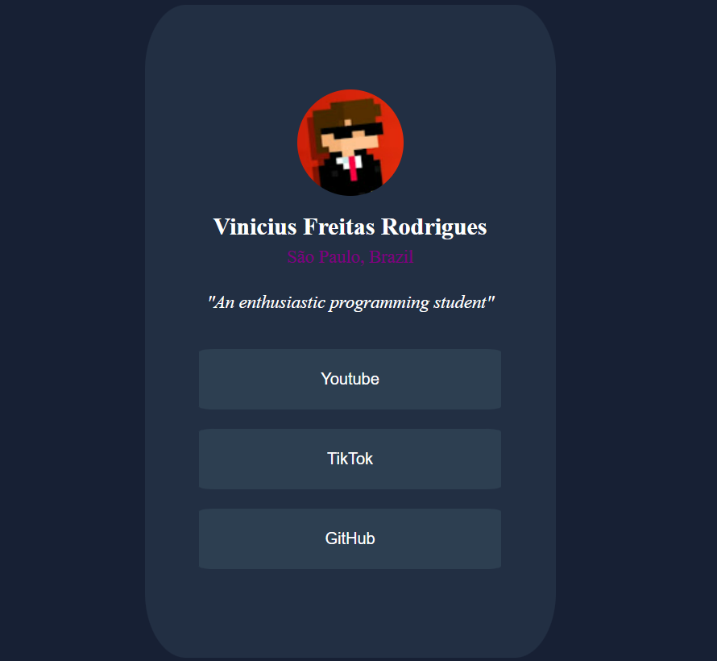

# Frontend Mentor - Social Links Profile Solution

This is a solution to the [Social Links Profile challenge on Frontend Mentor](https://www.frontendmentor.io/challenges/social-links-profile-UG32l9m6dQ). Frontend Mentor challenges help you improve your coding skills by building realistic projects.

## 📘 Introduction

Hi! I'm Vinicius, a Brazilian programming student, and this is my first HTML and CSS project.  
In this challenge, I had to create a social links profile based on a predefined layout.  
I made a few custom changes to give it my personal touch. I hope you enjoy it!

## 🎯 Objectives

- Add a profile image  
- Create a short biography  
- Add interactive buttons with links to social media  

## 🖼️ Preview

  


## 🚀 How to Use

1. Clone the repository:
   ```bash
   git clone https://github.com/vicius13/social-links-profile.git
2. Open index.html in your browser.

## 👨‍💻 Author

Made by Vinicius Freitas Rodrigues
[Github Profile](https://github.com/vicius13)

## 📝 License

This project is for study purposes only — not for commercial use.